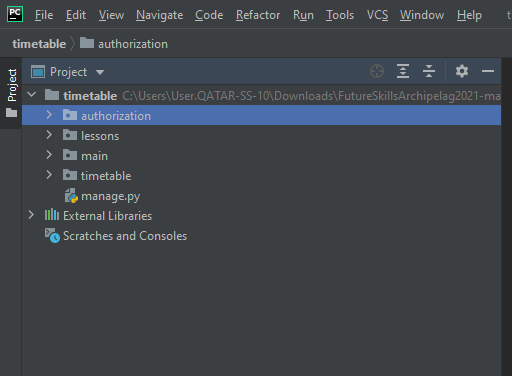

# FutureSkillsArchipelag2021

## Как запустить веб сервер
1) Запустить PyCharm.
2) Открыть через программу папку timetable (находится в "Task 1-1/django/timetable"). 
3) У вас должен открыться проект с такими компонентами:

4) Необходимо открыть `file->settings->Project: timetable->Python Interpreter`. Затем нажать на шестерёнку и Add

5) Выберете произвольное место для виртуального окружения (можно оставить стандартно)
6) Нажмите ОК
7) После загрузки закройте окно
8) Откройте нижнюю панель Terminal (Если была открыта - закройте и откройте заново - это важно, иначе среда не перейдёт в виртуальное окружение)
9) У вас должно быть подключение к интернету!
10) Введите

```
pip install -r requirements.txt
```

11) Сделайте миграции:

```
python manage.py makemigrations
python manage.py migrate
```

12) Создаёте учётную запись админа:

```
python manage.py createsupreuser
```

13) Введите логин, почту и пароль. Введение пароля отображаться не будет - это нормально
14) Запустите сервер

```
python manage.py runserver
```

15) Затем перейдите в браузере по ссылке 
```
http://127.0.0.1:8000
```

Приложение поднимается на локальном сервере

## Работа с сайтом
- Не успели дописать (
